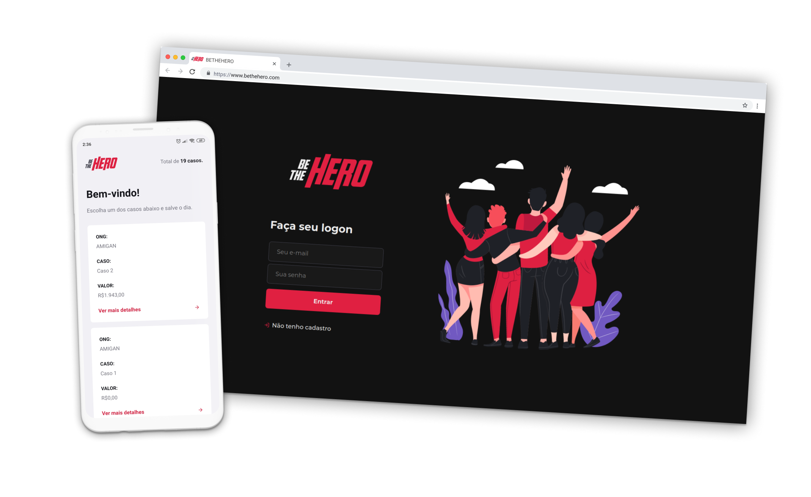

<h1 align="center">
BeTheHero
</h1>
<blockquote align="center">
:two_hearts: App para ajudar ONGs na divulgação de "casos"
</blockquote>

## :mag: Sobre o projeto

Este projeto foi desenvolvido durante a Semana Omnistack da Rocketseat e implementado por mim.

Esta é uma Aplicação onde ONGs podem se cadastrar, adicionar e remover "casos" com título, descrição e valor e os usuários, pelo APP mobile, poderão listar esses casos.

## :rocket: Implementações

<table>
  <thead>
    <th>Web</th>
    <th>Mobile</th>
    <th>Back end</th>
  </thead>
  <tbody>
    <tr>
      <td>Styled-Components</td>
      <td>Styled-Components</td>
      <td>JWT</td>
    </tr>
    <tr>
      <td>Context API</td>
      <td>Temas Dark e White</td>
      <td>Yup para validação</td>
    </tr>
    <tr>
      <td>Redirect em rotas protegidas</td>
      <td>O tema se adapta à aparência do smartphone</td>
      <td></td>
    </tr>
    <tr>
      <td>Yup para validação dos inputs</td>
      <td></td>
      <td></td>
    </tr>
  </tbody>
</table>

## :satellite: Tecnologias utilizadas

* <a target="_blank" href="https://reactnative.dev/">React Native</a>
* <a target="_blank" href="https://github.com/facebook/react">React</a>
* <a target="_blank" href="https://nodejs.org/en/docs/">Node.js</a>

## :man_mechanic: Iniciando o projeto

1. Clone este repositório usando: `git clone https://github.com/perinazzoo/rocketseat-omnistack10.git`;
2. Vá para o diretório usando: `cd rocketseat-omnistack10`;
3. Entre em cada uma das 3 pastas com o comando `cd "nome_da_pasta"`;
4. Rode o comando `yarn` para instalar todas as dependências;
5. Entre na pasta com o comando: `cd backend`;
6. Inicie o servidor com `yarn dev`;
7. Entre na próxima pasta com o comando: `cd ../frontend-mobile`;
8. Rode o comando `npx react-native start` para iniciar o servidor;
9. Rode o comando `npx react-native run-android` para instalar o App no seu dispositivo/emulador;
10. Entre na próxima pasta com o comando: `cd ../frontend-web`;
11. Rode o comando `yarn start` para iniciar a aplicação;

 
<blockquote>Feito com :coffee: e :heart: por Gabriel Perinazzo</blockquote>